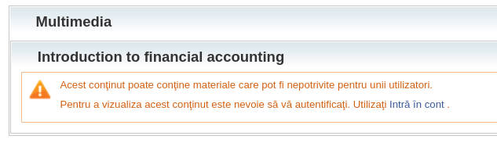
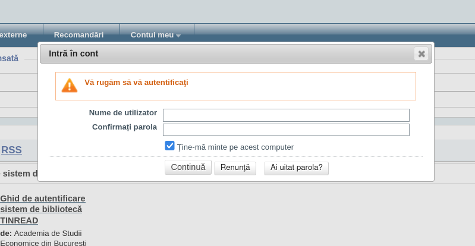
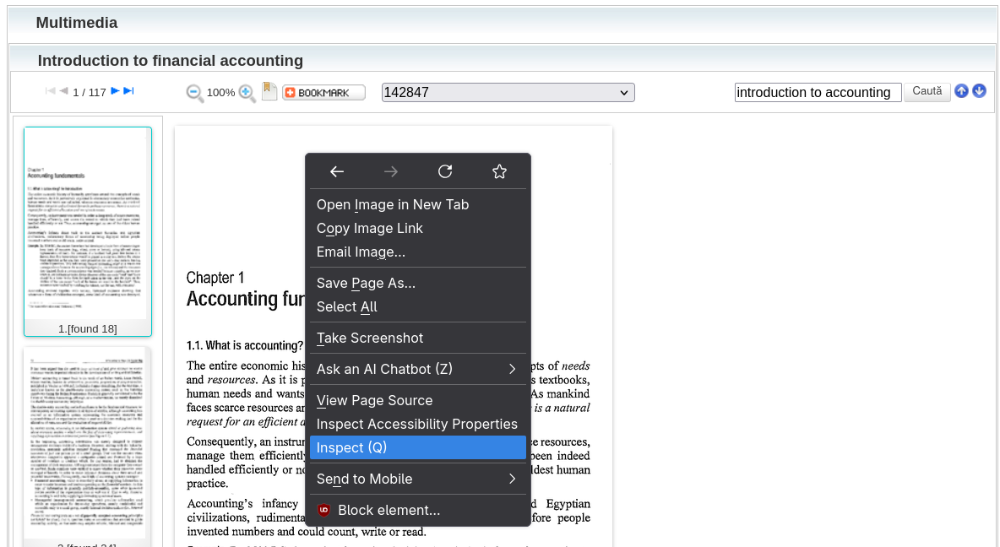
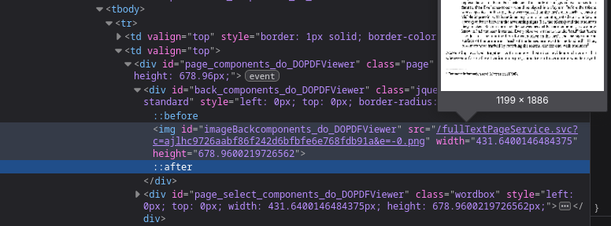
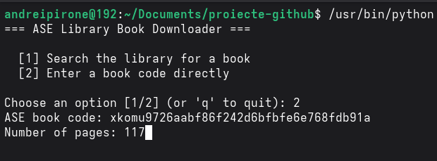
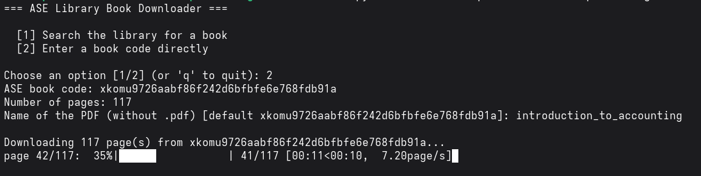

# ASE Library Book Downloader

A Python script to download books from the ASE (Academia de Studii Economice din București) digital library and stitch them into a single PDF.

## Requirements

- Python 3.x
- `requests`
- `beautifulsoup4`
- `Pillow`
- `img2pdf`

## Installation

```bash
pip install -r requirements.txt
```

## Usage

```bash
python asedownload.py
```

```
=== ASE Library Book Downloader ===

  [1] Search the library for a book
  [2] Enter a book code directly

Choose an option [1/2] (or 'q' to quit):
```

1. Type a search query (title, author, ISBN, …).
2. Pick a book from the list of results.
3. Review the book's details and the discovered subsections.
4. Confirm (or override) the number of pages to download and the PDF file name.
5. The script downloads the pages of the best-matching subsection and stitches them into a PDF.

### Entering the book code directly (recommended when the contents of a book can only be accessed with an account)

<p align="center">
  
</p>

  1. Login on the website with your ASE account.
<p align="center">
  
  </p>

  2. Under the "Multimedia" section right-click inspect over one of the pages.
<p align="center">
  
  </p>

  3. Find the `` tag where the image link is found or simply CTRL-F and search for it by this id: `imageBackcomponents_do_DOPDFViewer`. You should see a link that is something like `/fullTextPageService.svc?c=abcdefg12345&e=-0.png`. Copy the code that's after `c=` until the `&`.
<p align="center">
  
  </p>

  4. Run the script and choose 2: `Enter a book code directly`. Paste the code and the number of pages manually.
<p align="center">
  
  </p>

  5. Wait for the download and enjoy!
<p align="center">
  
  </p>

## Notes

- Some books are restricted and cannot be downloaded unless you have an ASE account (see the section above).
- This tool is intended for educational and personal use only. Please respect the ASE library terms of use.

## Disclaimer

This tool is not affiliated with or endorsed by Academia de Studii Economice din București.
